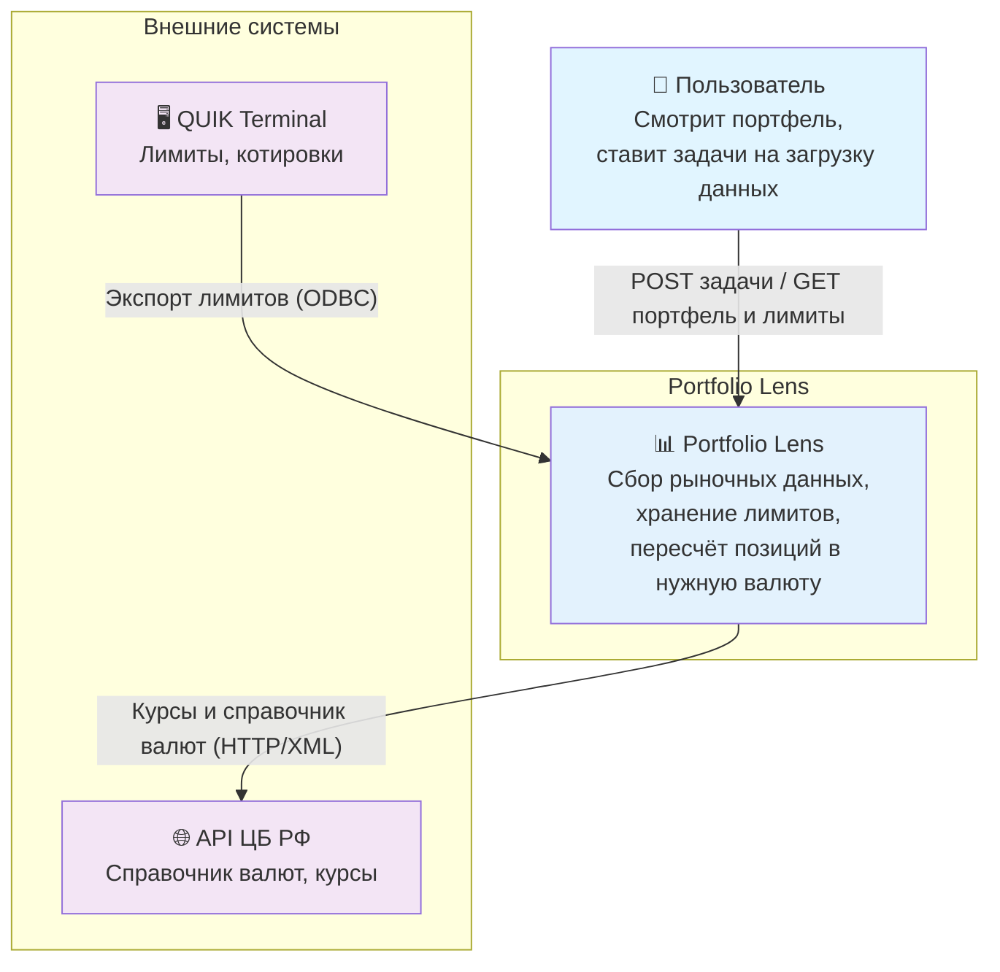
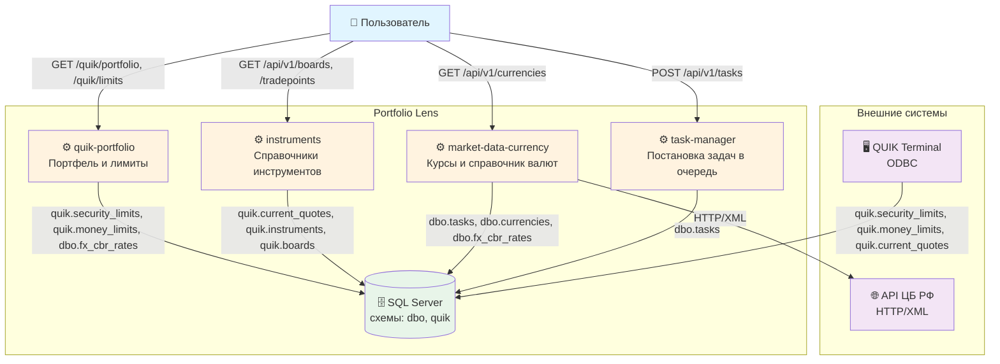

# Portfolio Lens
Инструмент для расчёта инвестиционного портфеля. Портфель лежит у нескольких брокеров, позиции - в разных валютах, инструменты торгуются на разных площадках. Чтобы получить одну цифру, нужно всё это свести: забрать позиции, взять актуальные котировки и курсы валют, пересчитать в одну валюту.

Сейчас работает с брокерами на базе QUIK (ВТБ, БКС и другие). QUIK сам пишет лимиты и котировки в БД через ODBC - этого достаточно, чтобы видеть текущие позиции и их рыночную стоимость в реальном времени. Курсы валют берутся из API ЦБ РФ, потому что не все валюты торгуются на бирже.

## Архитектура
### Контекст системы

### Контейнеры


## Сервисы
### [task-manager](task-manager/)
Один endpoint - `POST /api/v1/tasks`. Принимает код действия и параметры, создаёт запись в `dbo.tasks`. UUID генерируется сам (v7), либо можно передать свой - тогда повторный запрос с тем же UUID вернёт конфликт. Если параметры не удалось сохранить после создания задачи, статус сразу откатывается в Error.
### [market-data-currency](market-data-currency/)
Каждую секунду забирает одну задачу из `dbo.tasks`. Для каждой задачи читает конфигурацию действия из БД, динамически собирает HTTP-запрос (URL, query-параметры, заголовки), идёт в API ЦБ РФ, парсит XML и сохраняет результат.

Три типа задач: справочник валют, курсы на сегодня/завтра, история курсов по конкретной валюте. Второй воркер раз в минуту сливает кросс-курсы из котировок QUIK.

API ЦБ отдаёт XML в Windows-1251 с запятой как десятичным разделителем - парсинг это учитывает.
### [instruments](instruments/)
Два воркера. Первый каждую секунду берёт строки из `quik.current_quotes`, у которых ещё нет привязки к инструменту, создаёт или обновляет записи в `quik.instruments` и `quik.instrument_boards`. Второй раз в минуту синхронизирует справочники (типы и подтипы инструментов, борды, торговые площадки) из тех же котировок.
### [quik-portfolio](quik-portfolio/)
Принимает лимиты из QUIK через POST (по бумагам, деньгам, OTC). Четыре воркера раз в минуту проверяют, есть ли пропуск с последней загрузки до сегодня, и если есть - копируют последние известные лимиты вперёд (roll-forward). Каждый воркер помнит дату последнего успешного переноса через `atomic.Int64`, чтобы не дёргать БД лишний раз.

Endpoint `GET /quik/portfolio` делает три запроса к БД параллельно через `errgroup` и пересчитывает стоимость позиций в нужную валюту через SQL-функцию `dbo.fnFxRateToRub`.
### [pkg/](pkg/)
Переиспользуемые пакеты для всех сервисов: HTTP handler adapter (маппинг ошибок в коды), periodic workers, request planner, Prometheus-метрики, `RuFloat` XML Unmarshaler, `DecodeAndValidate[T]` с generics.

## Как устроено
Сервисы разделены по смыслу: что торгуется (instruments), почём валюта (market-data-currency), сколько у меня есть (quik-portfolio). Сервисный слой зависит от интерфейсов, репозитории подставляются через DI. Ошибки доменные, handler adapter маппит их в HTTP-коды.

## QUIK Terminal
QUIK - торговый терминал, через который работают многие российские брокеры (ВТБ, БКС и другие). У него есть встроенный экспорт таблиц в БД через ODBC: лимиты по бумагам и деньгам пишутся автоматически при каждом обновлении данных у брокера. Котировки попадают туда же.

Portfolio Lens читает эти данные напрямую из БД - никакого дополнительного слоя интеграции не нужно. Единственное исключение - OTC-лимиты: QUIK их не экспортирует, поэтому они загружаются вручную через `POST /quik/limits/securities/otc`.

Инструкция по настройке экспорта - в [README quik-portfolio](quik-portfolio/README.md#настройка-экспорта-из-quik).

## Стек
Go 1.24 · Chi · Zap · Prometheus · SQL Server (go-mssqldb)

## Запуск
SQL Server с миграциями из [`scripts/sql/`](scripts/sql/) и `config.yaml` для каждого сервиса (примеры в README сервисов). Пароль БД можно передать через `DB_PASSWORD`.

```bash
go run ./task-manager/cmd
go run ./market-data-currency/cmd
go run ./instruments/cmd
go run ./quik-portfolio/cmd
```

## Тесты
```bash
go test ./...
```
